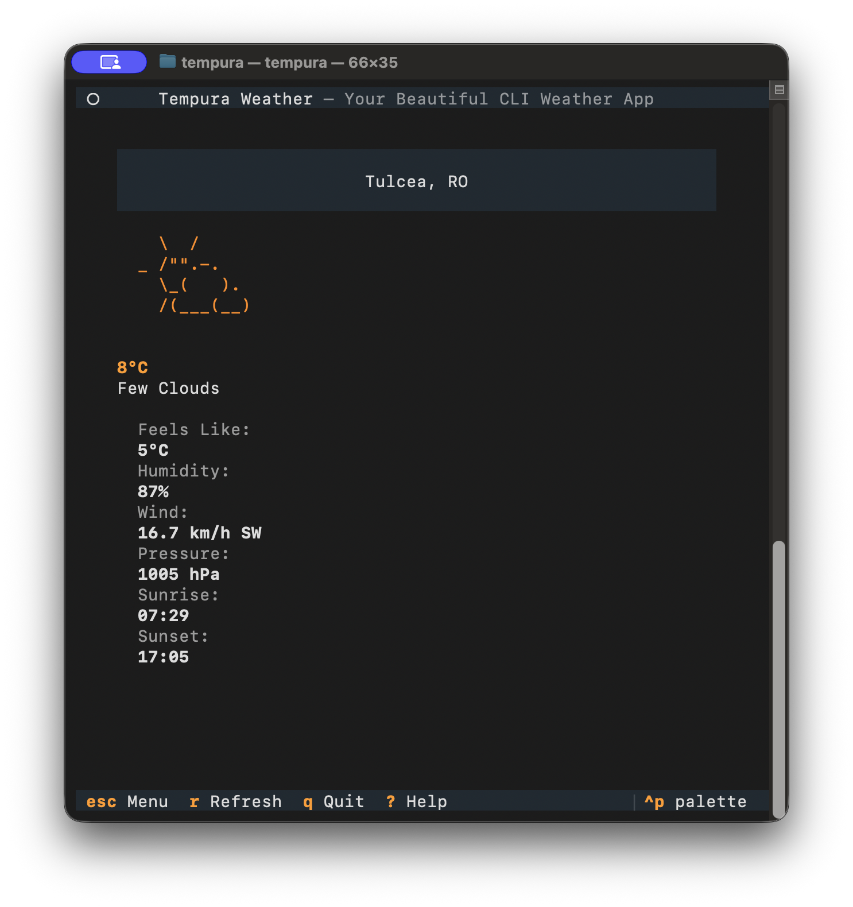

# Tempura ☀️

A beautiful CLI weather application with animated ASCII art icons, built with Python and Textual.

## Features

- **Current Weather Display** - View real-time weather conditions with animated ASCII art icons
- **Multi-Day Forecast** - Browse daily weather predictions in an elegant card layout
- **Hourly Forecast** - Check hour-by-hour weather for the next 48 hours
- **Multiple Locations** - Save and manage your favorite cities
- **Customizable Settings** - Configure temperature units, animation preferences, and more
- **Beautiful UI** - Professional terminal interface with smooth navigation
- **Auto-refresh** - Automatic weather updates at configurable intervals

## Screenshots

### Main Menu


### Current Weather


### Multi-Day Forecast


### 48-Hour Forecast


### Multiple Locations


### Settings


## Installation

### Requirements

- Python 3.10 or higher
- OpenWeatherMap API key (free tier available)

### Install with Poetry (Recommended)

```bash
# Clone the repository
cd tempura

# Install dependencies
poetry install

# Run the application
poetry run tempura
```

### Install with pip

```bash
# Clone the repository
cd tempura

# Install dependencies
pip install -e .

# Run the application
tempura
```

## Getting Started

### 1. Get an API Key

Sign up for a free OpenWeatherMap API key:
https://openweathermap.org/api

The free tier includes:
- Current weather data
- 5-day/3-hour forecast
- 60 calls per minute
- 1,000,000 calls per month

### 2. First Run

When you first launch Tempura, you'll be guided through a setup wizard:

```bash
poetry run tempura
```

The wizard will ask for:
1. Your OpenWeatherMap API key
2. Your default location (city name)

### 3. Using the App

Navigate using:
- **Arrow keys** - Move through menus and lists
- **Enter** - Select an item
- **q** - Quit
- **m** / **Esc** - Return to main menu
- **r** - Refresh current screen
- **?** - Show help

## Configuration

### Config File Location

Tempura stores its configuration at:
- **Linux**: `~/.config/tempura/config.json`
- **macOS**: `~/Library/Application Support/tempura/config.json`
- **Windows**: `%APPDATA%/tempura/config.json`

### Environment Variables

You can also set the API key via environment variable:

```bash
export OPENWEATHER_API_KEY="your_api_key_here"
poetry run tempura
```

Or use a `.env` file:

```bash
cp .env.example .env
# Edit .env and add your API key
```

### Settings

Access the Settings screen from the main menu to configure:
- **Temperature Unit** - Fahrenheit or Celsius
- **Wind Speed Unit** - mph, km/h, or m/s
- **Time Format** - 12-hour or 24-hour
- **Auto-refresh Interval** - 1-60 minutes
- **Animations** - Enable/disable weather animations

## CLI Usage

Tempura also supports non-interactive CLI mode:

### Current Weather

```bash
# Get current weather for a location
poetry run python -m tempura.cli current "San Francisco"

# With specific options
poetry run python -m tempura.cli current "London" --unit celsius --api-key YOUR_KEY
```

### Forecast

```bash
# Get multi-day forecast
poetry run python -m tempura.cli forecast "Tokyo" --days 7

# With specific temperature unit
poetry run python -m tempura.cli forecast "Paris" --days 5 --unit celsius
```

## Managing Locations

From the **Manage Locations** screen:
- **A** - Add a new location
- **D** - Delete the selected location
- **S** - Set the selected location as default
- **Enter** - Select a location as current

You can save up to 10 favorite locations.

## Project Structure

```
tempura/
├── tempura/
│   ├── api/              # OpenWeatherMap API client
│   ├── assets/           # ASCII art and CSS styles
│   ├── config/           # Configuration management
│   ├── screens/          # Textual UI screens
│   ├── weather/          # Weather data formatting
│   ├── widgets/          # Custom UI widgets
│   ├── app.py            # Main application
│   ├── cli.py            # CLI commands
│   └── __main__.py       # Entry point
├── tests/                # Test suite
├── pyproject.toml        # Project dependencies
└── README.md            # This file
```

## Development

### Run Tests

```bash
poetry run pytest
```

### Code Formatting

```bash
poetry run black tempura
poetry run ruff check tempura
```

### Run in Development Mode

```bash
poetry run python -m tempura
```

## Weather Conditions

Tempura displays beautiful ASCII art for various weather conditions:
- ☀️ Clear/Sunny
- 🌙 Clear Night
- ⛅ Partly Cloudy
- ☁️ Cloudy
- 🌧️ Rain
- ⛈️ Thunderstorm
- ❄️ Snow
- 🌫️ Mist/Fog

Animations bring the weather to life with:
- Falling raindrops
- Drifting clouds
- Falling snow
- Lightning flashes

## Troubleshooting

### "API key not found" error

Make sure you've:
1. Completed the setup wizard, or
2. Set the `OPENWEATHER_API_KEY` environment variable, or
3. Added your API key in the Settings screen

### "Location not found" error

Try:
- Using just the city name: `"San Francisco"`
- Including the country: `"London, UK"`
- Being more specific: `"Portland, Oregon, US"`

### "Rate limit exceeded" error

The free tier allows 60 calls per minute. If you hit this limit:
- Wait a minute before retrying
- Increase the auto-refresh interval in Settings
- Consider the cached data (10-minute default TTL)

### API key not working immediately

New API keys may take a few minutes to activate. If you just signed up, wait 10-15 minutes and try again.

## License

MIT License - feel free to use and modify as needed.

## Credits

- Built with [Textual](https://github.com/Textualize/textual) - Terminal User Interface framework
- Weather data from [OpenWeatherMap](https://openweathermap.org/)
- ASCII art inspired by [wttr.in](https://wttr.in/)

## Contributing

Contributions welcome! Feel free to:
- Report bugs
- Suggest features
- Submit pull requests

## Future Enhancements

Planned features:
- Weather alerts and warnings
- Air quality index
- UV index display
- Historical weather data
- Weather maps (ASCII visualization)
- Multiple API provider support
- Custom themes
- Export data to JSON/CSV
- Internationalization

---

Enjoy your beautiful weather app! ☀️🌧️❄️
